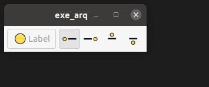

# cap3_basico gtkmm 3.0

## OBS : Este é um "caderno", as informações contidas neste arquivo são anotações pessoais e podem apresentar informações incorretas.

## APP

* Este exemplo mostra os tipos de posicionamentos de imagens em um botão.

    * Para inserir as imagens foi utilizado os seguintes procedimentos;

        ~~~c
        this->ref1= Gdk::Pixbuf::create_from_file("img/d.svg",24,24,false);
        this->m_btn1.set_tooltip_text("Gtk::POS_RIGHT");
        this->img1.set(this->ref1);
        this->m_btn1.set_image(this->img1);
        ~~~

    * Para posicionamento das imagens foi utilizado os seguintes procedimentos.

        ~~~c
        set_image_position(Gtk::POS_LEFT);

        set_image_position(Gtk::POS_RIGHT);
        
        set_image_position(Gtk::POS_TOP);

        set_image_position(Gtk::POS_BOTTON);
        ~~~

    * Outro método utilizado foi o `void Gtk::Button::set_relief(Gtk::ReliefStyle relief)`, este método retira a borda do botão de forma parcial ou completamente.

        ~~~c
        Gtk::RELIEF_NORMAL
        Gtk::RELIEF_HALF
        Gtk::RELIEF_NONE
        ~~~

    * Para manter os botoes pressionados foi utilizado o método `void Gtk::Widget::set_state_flags(Gtk::StateFlags flags, bool clear = true)`.

        ~~~c
        Gtk::STATE_FLAG_NORMAL
        Gtk::STATE_FLAG_CHECKED
        ~~~

        O primeiro volta ao estado normal, o segundo mantém o botão pressionado.